# OCCT 布尔运算流程

本文档以 Mermaid 图表的形式，完整描述 Open CASCADE Technology 布尔运算的内部执行流程。

---

## 1. 整体架构

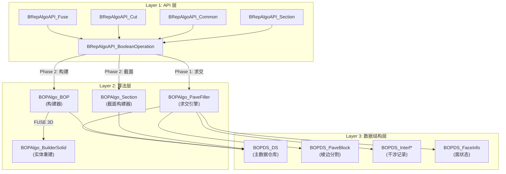

---

## 2. 类继承体系

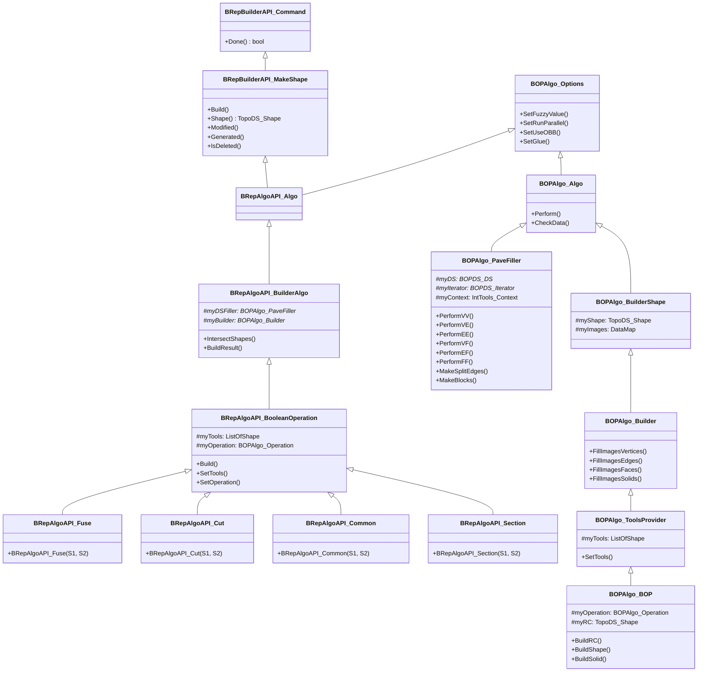

---

## 3. 主流程：BRepAlgoAPI_BooleanOperation::Build()

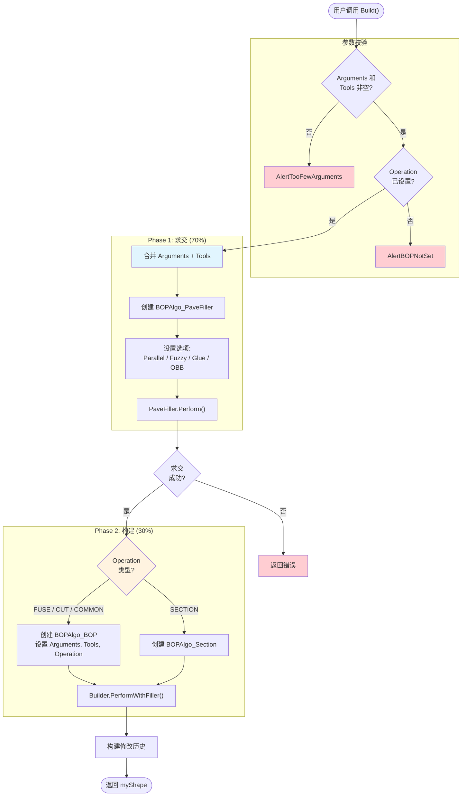

---

## 4. PaveFiller 求交引擎：14 步详解

```mermaid
flowchart TD
    INIT["Init()<br/>创建 BOPDS_DS + Iterator + Context"]
    INIT --> PREPARE["Prepare()<br/>构建平面面的 p-curve"]

    PREPARE --> VV["① PerformVV()<br/>顶点-顶点求交"]
    VV --> VE["② PerformVE()<br/>顶点-棱边求交"]
    VE --> UPD1["UpdatePaveBlocksWithSDVertices()"]

    UPD1 --> EE["③ PerformEE()<br/>棱边-棱边求交"]
    EE --> UPD2["UpdatePaveBlocksWithSDVertices()"]

    UPD2 --> VF["④ PerformVF()<br/>顶点-面求交"]
    VF --> UPD3["UpdatePaveBlocksWithSDVertices()"]

    UPD3 --> EF["⑤ PerformEF()<br/>棱边-面求交"]
    EF --> UPD4["Update SD Vertices + Interferences"]

    UPD4 --> REPEAT["⑥ RepeatIntersection()<br/>容差增大后重新 VV/VE/VF"]
    REPEAT --> FORCE_EE["⑦ ForceInterfEE()<br/>强制棱边-棱边检查"]
    FORCE_EE --> FORCE_EF["⑧ ForceInterfEF()<br/>强制棱边-面检查"]

    FORCE_EF --> FF["⑨ PerformFF()<br/>面-面求交 (最耗时)"]
    FF --> UPD5["UpdateBlocksWithSharedVertices()<br/>RefineFaceInfoIn()"]

    UPD5 --> SPLIT["⑩ MakeSplitEdges()<br/>从 PaveBlock 创建分割棱边"]
    SPLIT --> BLOCKS["⑪ MakeBlocks()<br/>从 FF 交线构建截面棱边"]
    BLOCKS --> CHECK["CheckSelfInterference()"]

    CHECK --> PCURVES["⑫ MakePCurves()<br/>构建面上的 2D 曲线"]
    PCURVES --> DE["⑬ ProcessDE()<br/>处理退化棱边"]
    DE --> MICRO["⑭ RemoveMicroEdges()"]
    MICRO --> DONE(["BOPDS_DS 完成:<br/>包含完整求交数据"])

    style VV fill:#c8e6c9
    style VE fill:#c8e6c9
    style EE fill:#c8e6c9
    style VF fill:#c8e6c9
    style EF fill:#c8e6c9
    style FF fill:#ffcc80
    style SPLIT fill:#b3e5fc
    style BLOCKS fill:#b3e5fc
    style PCURVES fill:#b3e5fc
    style DONE fill:#a5d6a7
```

---

## 5. 求交引擎各步骤的输入输出

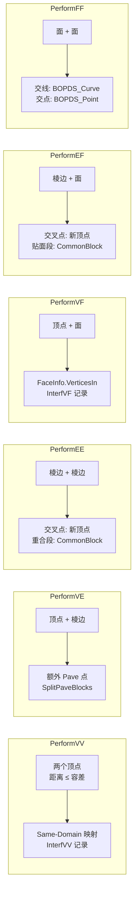

---

## 6. PaveBlock 棱边分割过程

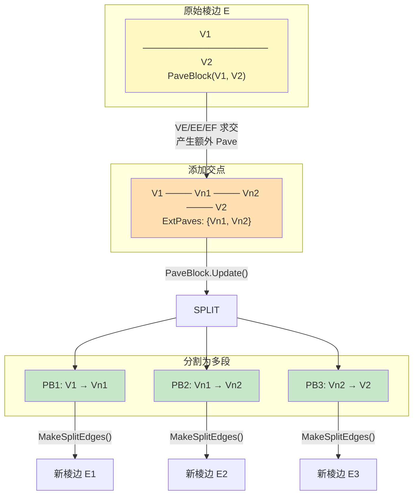

---

## 7. BOPAlgo_BOP 构建阶段

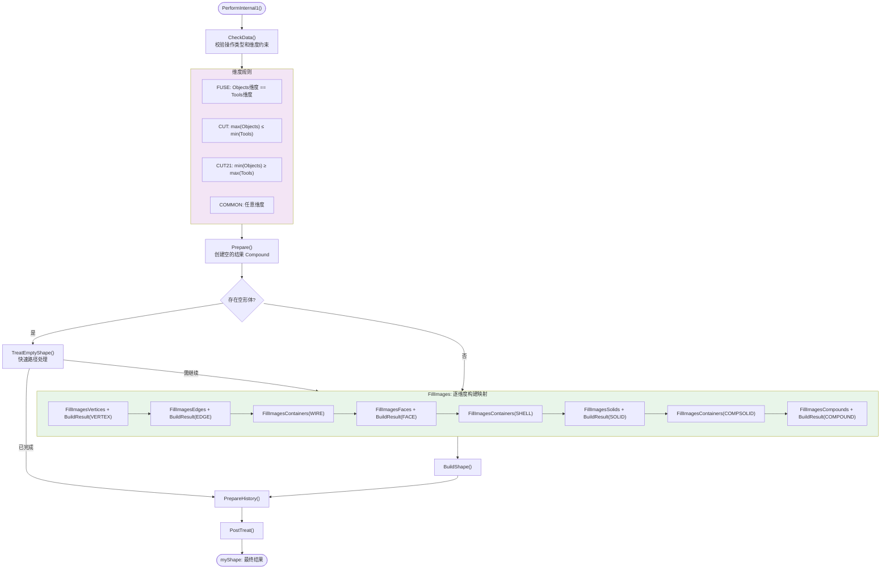

---

## 8. BuildShape() 按操作类型的分支

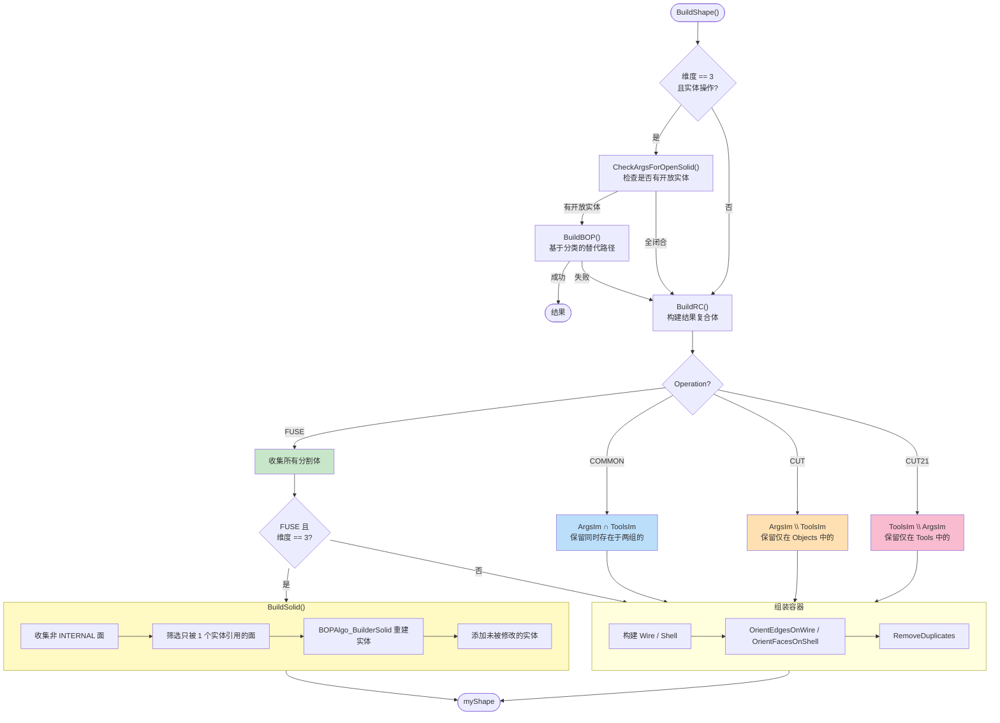

---

## 9. BuildSolid: FUSE 实体重建

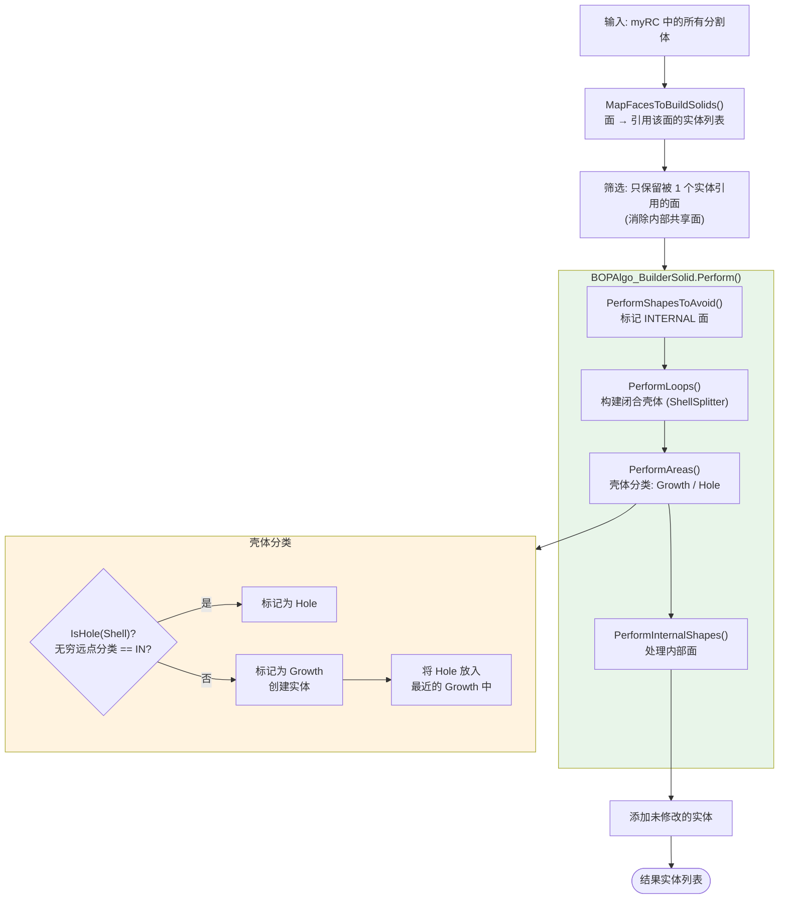

---

## 10. 完整数据流

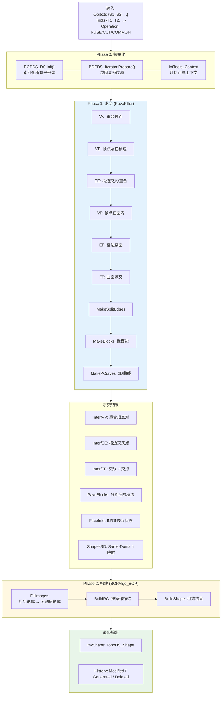

---

## 11. 操作类型枚举

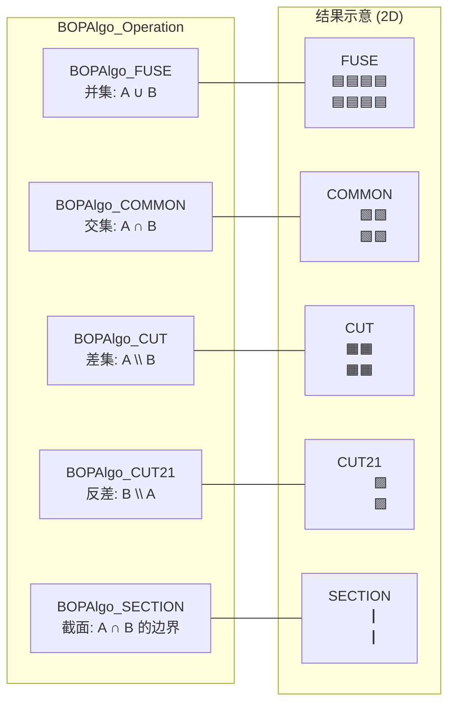

---

## 12. 关键源码文件索引

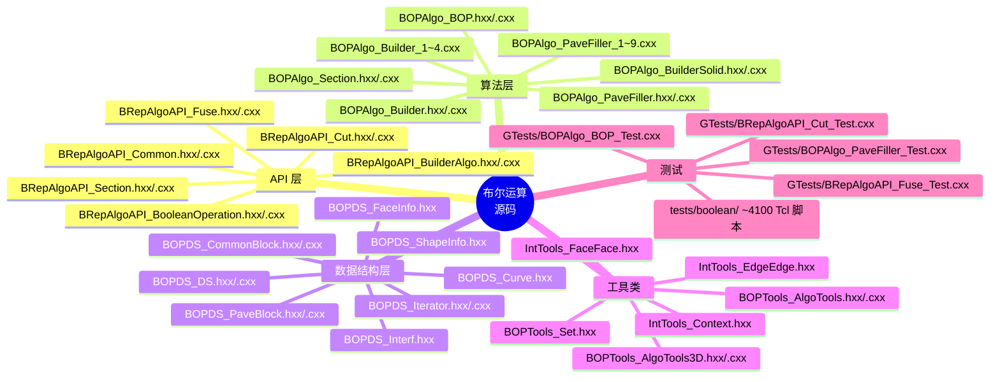

---

## 13. 测试覆盖矩阵

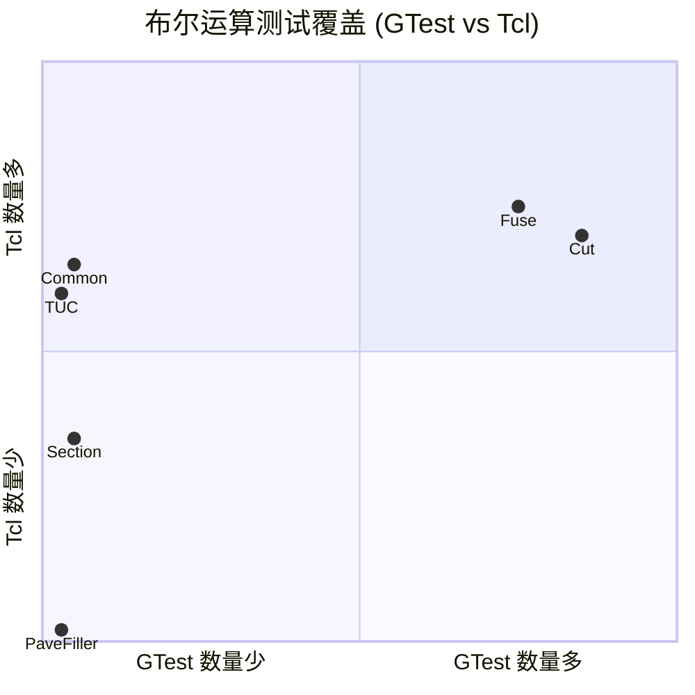

---

## 附录: 源文件路径

所有文件位于 `src/ModelingAlgorithms/TKBO/` 下：

| 包 | 路径 |
|---|------|
| BRepAlgoAPI | `src/ModelingAlgorithms/TKBO/BRepAlgoAPI/` |
| BOPAlgo | `src/ModelingAlgorithms/TKBO/BOPAlgo/` |
| BOPDS | `src/ModelingAlgorithms/TKBO/BOPDS/` |
| BOPTools | `src/ModelingAlgorithms/TKBO/BOPTools/` |
| GTests | `src/ModelingAlgorithms/TKBO/GTests/` |
| Tcl Tests | `tests/boolean/` (35 个测试组, ~4100 个脚本) |
| 官方文档 | `dox/specification/boolean_operations/boolean_operations.md` |
